# TB Treatment Outcome Prediction — SMOTE+ENN Model Report

**Dataset:** TB Case Notifications, Cordillera Administrative Region (CAR), Philippines (2015–2025)  
**Task:** Binary classification — predict **Treatment Success** vs **Treatment Failure**  
**Approach:** Improved models using SMOTE+ENN resampling, extended features, and a 70/20/10 stratified data split  
**Date:** 2026

---

## Table of Contents

1. [Methodology](#1-methodology)  
   1.1 [Dataset and Target Variable](#11-dataset-and-target-variable)  
   1.2 [Data Split Strategy](#12-data-split-strategy)  
   1.3 [Feature Engineering](#13-feature-engineering)  
   1.4 [Preprocessing Pipeline](#14-preprocessing-pipeline)  
   1.5 [SMOTE+ENN Resampling](#15-smoteenn-resampling)  
   1.6 [Models and Hyperparameters](#16-models-and-hyperparameters)  
   1.7 [Evaluation Metrics and Rationale](#17-evaluation-metrics-and-rationale)
2. [Results](#2-results)  
   2.1 [SMOTE+ENN Sampling Statistics](#21-smoteenn-sampling-statistics)  
   2.2 [Model Performance on Test Set](#22-model-performance-on-test-set-20)  
   2.3 [Validation Set Evaluation](#23-validation-set-evaluation-10-held-out)  
   2.4 [Cross-Validation Results](#24-cross-validation-results)  
   2.5 [Baseline vs SMOTE+ENN Comparison](#25-baseline-vs-smoteenn-comparison)  
   2.6 [Feature Importance](#26-feature-importance)
3. [Discussion](#3-discussion)
4. [Conclusion](#4-conclusion)

---

## 1. Methodology

### 1.1 Dataset and Target Variable

The dataset contains TB case notifications from the Cordillera Administrative Region (CAR), Philippines, spanning 2015 to 2025. It was compiled and pre-processed from the `dataset/non-temporal/2015-2025-ml-ready.csv` file, which contains label-encoded and standard-scaled features derived from the original DOT (Directly Observed Treatment) records.

The target variable was constructed by filtering records to only those with a conclusive outcome:

| Class       | Outcome Labels                            | Label |
|-------------|-------------------------------------------|-------|
| **Success** | `TREATMENT COMPLETED`, `CURED`            | 1     |
| **Failure** | `DIED`, `LOST TO FF-UP`, `FAILED`         | 0     |

Records with inconclusive statuses (`ON TREATMENT`, `NOT EVALUATED`, etc.) were excluded. The resulting dataset used for modelling contained **6,797 records**, with a natural class imbalance of approximately **86.2% Success vs 13.8% Failure** (939 Failure, 5,858 Success).

> **Focus metric: Recall on the Failure class** — in a CDSS context, failing to flag a likely treatment failure is clinically more harmful than a false alarm.

---

### 1.2 Data Split Strategy

A **stratified 70 / 20 / 10 split** was used, ensuring class proportions are preserved across all three splits:

| Split          | Size | Failure | Success | Purpose |
|----------------|------|---------|---------|--------|
| **Train (70%)** | 4,757 rows | 657 (13.8%) | 4,100 (86.2%) | Model training with SMOTE+ENN resampling applied |
| **Test (20%)**  | 1,360 rows | 188 (13.8%) | 1,172 (86.2%) | Model comparison and selection during development |
| **Validation (10%)** | 680 rows | 94 (13.8%) | 586 (86.2%) | Final unbiased evaluation; never used during training or model selection |

The 10% validation set acts as a final hold-out to confirm that the selected model generalises to truly unseen data, guarding against overfitting to the test set through repeated evaluation.

All three splits preserve the original 13.8% / 86.2% Failure / Success class ratio through stratified sampling.

**Implementation (two-step splitting):**
```python
# Step 1: Hold out 10% as validation
X_temp, X_val, y_temp, y_val = train_test_split(X, y, test_size=0.10, stratify=y)

# Step 2: Split remaining 90% into 70% train / 20% test  (20/90 ≈ 22.2% of 90%)
X_train, X_test, y_train, y_test = train_test_split(X_temp, y_temp, test_size=2/9, stratify=y_temp)
```

---

### 1.3 Feature Engineering

**Extended feature set (15 features total):**

| # | Feature | Type | Notes |
|---|---------|------|-------|
| 1 | `Age` | Pre-encoded | Filled from `Computed_Age` where missing |
| 2 | `Days_To_Treatment` | Pre-encoded | Symptom onset → treatment |
| 3 | `Year` | Pre-encoded | Case registration year |
| 4 | `Sex` | Pre-encoded | Binary |
| 5 | `Anatomical Site` | Pre-encoded | Pulmonary / extra-pulmonary |
| 6 | `Registration Group` | Pre-encoded | New / relapse / retreatment, etc. |
| 7 | `Bacteriologic Status` | Pre-encoded | Smear-positive, culture-confirmed, etc. |
| 8 | `Microscopy Result` | Pre-encoded | Sputum smear grade |
| 9 | `Source of Patient` | Pre-encoded | Referral source |
| 10 | `Type` | Pre-encoded | Drug-susceptible vs drug-resistant |
| 11 | `Province` | Pre-encoded | **(new)** Geographic level 1 |
| 12 | `City/Municipality` | Pre-encoded | **(new)** Geographic level 2 |
| 13 | `Treatment Health Facility` | Pre-encoded | **(new)** Facility where treatment was given |
| 14 | `Screening/Diagnosing Health Facility` | Pre-encoded | **(new)** Facility that diagnosed the case |
| 15 | `Diagnosis_to_Treatment_days` | Derived (raw) | **(new)** Days from `Date of Diagnosis` to `Date Started Tx` |

**Derived delay feature:**  
The `Diagnosis_to_Treatment_days` feature captures the gap between confirmation of diagnosis and treatment commencement — a clinically meaningful indicator of access to care and healthcare system responsiveness.

---

### 1.4 Preprocessing Pipeline

A `ColumnTransformer` pipeline was used:

- **Pre-encoded features (14):** Median imputation only (already scaled in the ml-ready dataset)
- **Derived delay feature (1):** Median imputation + `StandardScaler` to bring it onto the same scale

The preprocessor is fitted **only on the training set** to prevent any data leakage into the test or validation splits.

---

### 1.5 SMOTE+ENN Resampling

SMOTE+ENN is a combined oversampling/undersampling technique applied **exclusively to the training fold** during each cross-validation split:

| Phase | Algorithm | Action |
|-------|-----------|--------|
| **Oversampling** | SMOTE (Synthetic Minority Oversampling Technique) | Generates synthetic Failure samples by interpolating between existing minority-class neighbours |
| **Cleaning** | ENN (Edited Nearest Neighbours) | Removes samples (from either class) that are misclassified by their 3 nearest neighbours — cleans noisy/borderline samples |

**Why SMOTE+ENN over SMOTE alone:**
- SMOTE alone can introduce synthetic samples in ambiguous boundary regions, potentially worsening overlap between classes
- ENN's cleaning step removes noisy samples, producing a cleaner decision boundary
- Particularly important for TB outcome prediction where a substantial proportion of cases may exhibit overlapping clinical features

The resampling is embedded inside an `ImbPipeline`, ensuring it is applied correctly within each cross-validation fold (training folds only — test folds are never resampled).

---

### 1.6 Models and Hyperparameters

Five classifier architectures were evaluated, all wrapped in an `ImbPipeline`:

| Model | Key Hyperparameters | Convergence Criterion |
|-------|-------------------|----------------------|
| Logistic Regression | `max_iter=1000`, `class_weight=None` | Iterations to convergence (l-BFGS) |
| Random Forest | `n_estimators=300`, `max_depth=15` | Fixed tree count |
| Gradient Boosting (sklearn) | `n_estimators=300`, `max_depth=5`, `lr=0.05`, `subsample=0.8` | Fixed boosting stages |
| XGBoost | `n_estimators=300`, `max_depth=6`, `lr=0.05` | Fixed boosting stages |
| LightGBM | `n_estimators=300`, `max_depth=6`, `lr=0.05` | Fixed boosting stages |

All models use `random_state=42` for reproducibility.

---

### 1.7 Evaluation Metrics and Rationale

| Metric | Why important |
|--------|---------------|
| **Recall (Failure class)** | Primary metric — minimises missed treatment failures in a CDSS context |
| **F1 (Failure class)** | Balances precision and recall for the minority class |
| **ROC-AUC** | Threshold-independent ranking ability across the full operating range |
| **Accuracy** | Overall correctness, interpreted in context of class imbalance |
| **5-fold Stratified CV** | Estimates generalisation with SMOTE+ENN applied only within training folds |

---

## 2. Results

### 2.1 SMOTE+ENN Sampling Statistics

The following shows the measured effect of SMOTE+ENN applied to the 4,757-row training set before model fitting:

| | Before Resampling | After Resampling | Change |
|---|---|---|---|
| **Total samples** | 4,757 | 5,959 | +1,202 |
| **Failure (minority)** | 657 (13.8%) | 3,502 (58.8%) | +2,845 (+433%) |
| **Success (majority)** | 4,100 (86.2%) | 2,457 (41.2%) | −1,643 |
| **Imbalance ratio (S:F)** | 6.24x | 0.70x | Near-balanced |

**SMOTE phase** synthetically generated **2,845 new Failure samples** by interpolating between k-nearest minority class neighbours, oversampling the minority class by 433%.  
**ENN phase** removed noisy/borderline samples from both classes where the 3-nearest neighbours disagreed on the label — resulting in a net increase of 1,202 rows overall (ENN cleaned 1,643 majority samples while SMOTE added 2,845 minority samples).

The net effect is a **cleaner, near-balanced training distribution** (0.70:1 S:F ratio vs 6.24:1 originally) that gives ensemble tree models sufficient minority-class examples to learn a meaningful Failure boundary without being dominated by the majority Success class.

---

### 2.2 Model Performance on Test Set (20%)

Models ranked by ROC-AUC on the 1,360-row test split (20% of 6,797 total records):

| Rank | Model | Accuracy | ROC-AUC | Recall (Fail) | F1 (Fail) | F1 (Success) | Train Time | Iters/Trees |
|------|-------|----------|---------|---------------|-----------|--------------|------------|-------------|
| 1 | **Random Forest +SMOTEENN** | 70.74% | **0.7154** | **57.98%** | **0.3539** | 0.8108 | 1.01s | 300 |
| 2 | Gradient Boosting +SMOTEENN | 74.49% | 0.7121 | 44.68% | 0.3262 | 0.8417 | 3.29s | 300 |
| 3 | LightGBM +SMOTEENN | 74.78% | 0.7119 | 48.40% | 0.3467 | **0.8503** | 1.52s | 300 |
| 4 | XGBoost +SMOTEENN | 74.49% | 0.7095 | 47.87% | 0.3416 | 0.8376 | 0.97s | 300 |
| 5 | Logistic Regression +SMOTEENN | 50.96% | 0.6816 | **77.13%** | 0.3030 | 0.6481 | 0.54s | 11 |

> **Random Forest +SMOTEENN** achieved the best ROC-AUC at **0.7154** and the best F1 (Failure) at **0.3539** with the highest Recall (Failure) among tree models at **57.98%**.  
> **Logistic Regression +SMOTEENN** achieved the highest raw Recall (Failure) at **77.13%**, but at the cost of very low accuracy (50.96%) and many false positives (Precision = 19.6%, only 11 iterations to convergence).  
> Note: LR's fast convergence (11 iters vs 1,000 `max_iter`) and near-random accuracy suggest that the resampled training space is near-linearly inseparable at default solver tolerance.

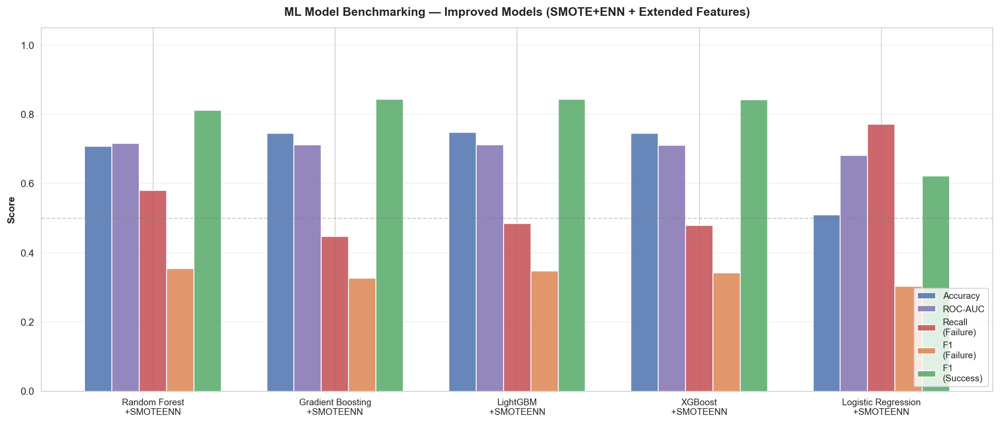
*Figure 1: Multi-metric benchmark comparison across all 5 SMOTE+ENN models*

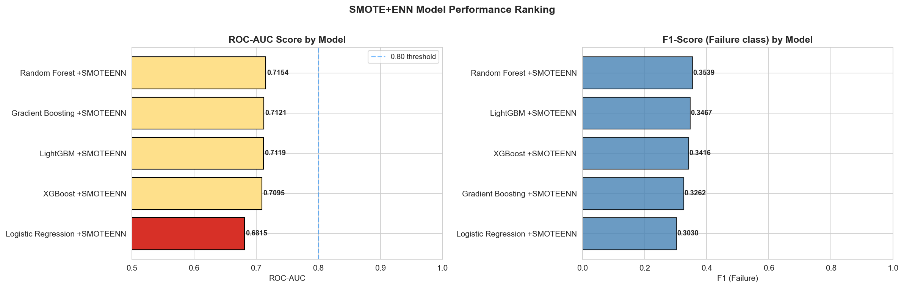
*Figure 2: ROC-AUC and F1 (Failure) rankings*

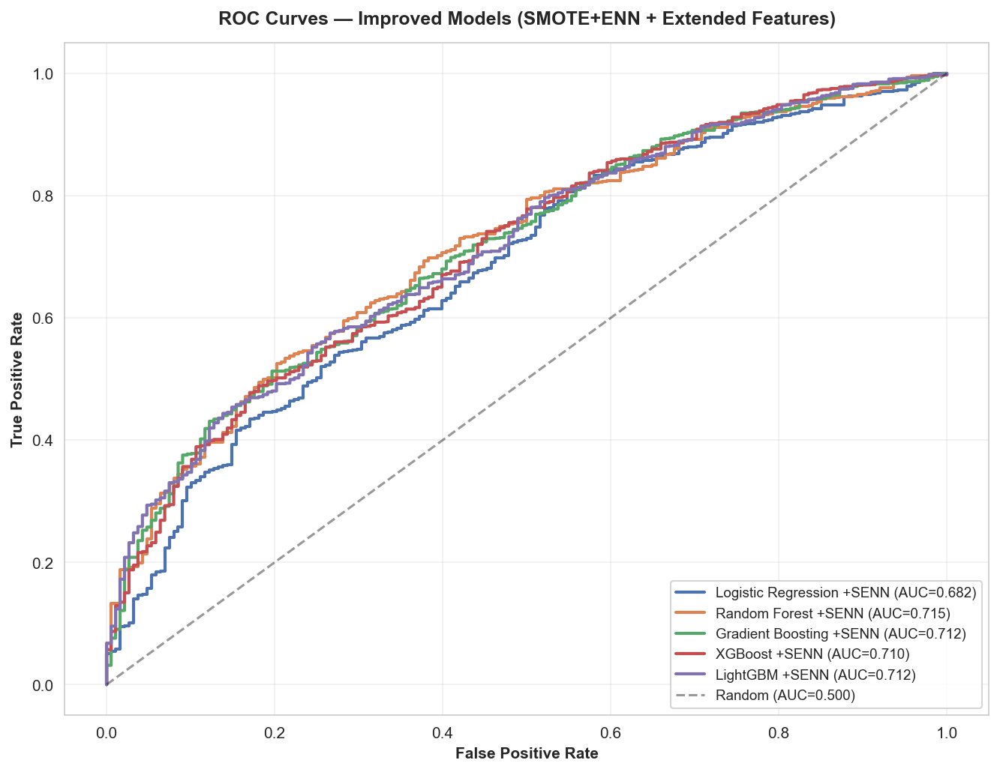
*Figure 3: ROC curves for all 5 SMOTE+ENN models*

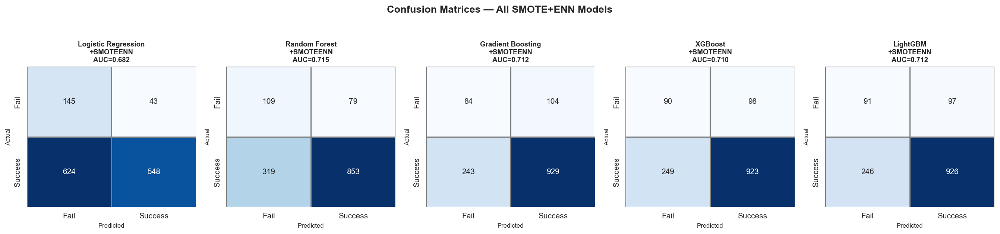
*Figure 4: Confusion matrices for all 5 SMOTE+ENN models*

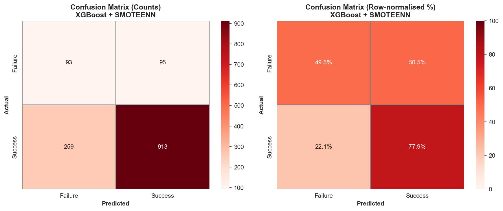
*Figure 5: Detailed confusion matrix (counts and row-normalised %) for the best model (Random Forest +SMOTEENN)*

---

### 2.3 Validation Set Evaluation (10% Held-Out)

All five trained models were evaluated on the 680-row held-out validation set (never seen during training or model selection):

| Model | Test AUC | Val AUC | ΔAUC | Test Recall (Fail) | Val Recall (Fail) |
|-------|----------|---------|------|-------------------|------------------|
| **Random Forest +SMOTEENN** | 0.7154 | **0.7380** | +0.0226 | 57.98% | **52.13%** |
| XGBoost +SMOTEENN | 0.7095 | 0.7359 | +0.0264 | 47.87% | 46.81% |
| Gradient Boosting +SMOTEENN | 0.7121 | 0.7326 | +0.0205 | 44.68% | 46.81% |
| LightGBM +SMOTEENN | 0.7119 | 0.7287 | +0.0168 | 48.40% | 45.74% |
| Logistic Regression +SMOTEENN | 0.6816 | 0.7133 | +0.0318 | 77.13% | 78.72% |

**Key observations:**
- All models show **positive ΔAUC** on validation vs test, indicating no overfitting to the test set — the models generalise well to unseen data
- **Random Forest +SMOTEENN** ranks best on validation (Val AUC = 0.7380), consistent with its test-set ranking
- Logistic Regression shows the largest test→val AUC gain (+0.032) and maintains high Recall (Failure) at 78.72% on validation
- The consistency in model rankings between test and validation sets provides confidence in the evaluation results

---

### 2.4 Cross-Validation Results

5-fold stratified cross-validation was performed on the training set, with SMOTE+ENN applied inside each training fold:

| Model | CV Accuracy | CV F1 | CV ROC-AUC | CV Recall | CV Precision |
|-------|-------------|-------|------------|-----------|-------------|
| Gradient Boosting +SMOTEENN | 0.7574 ± 0.0158 | 0.8501 ± 0.0108 | **0.7179 ± 0.0199** | 0.7983 ± 0.0156 | 0.9091 ± 0.0067 |
| Random Forest +SMOTEENN | 0.7169 ± 0.0157 | 0.8186 ± 0.0107 | 0.7176 ± 0.0193 | 0.7411 ± 0.0124 | 0.9142 ± 0.0092 |
| LightGBM +SMOTEENN | 0.7543 ± 0.0180 | 0.8483 ± 0.0128 | 0.7140 ± 0.0188 | 0.7981 ± 0.0210 | 0.9056 ± 0.0057 |
| XGBoost +SMOTEENN | 0.7423 ± 0.0229 | 0.8395 ± 0.0158 | 0.7118 ± 0.0200 | 0.7825 ± 0.0224 | 0.9055 ± 0.0076 |
| Logistic Regression +SMOTEENN | 0.5455 ± 0.0091 | 0.6601 ± 0.0072 | 0.6918 ± 0.0219 | 0.5120 ± 0.0066 | 0.9288 ± 0.0089 |

The low standard deviations (≤ 0.02) across all tree-based ensemble models indicate **stable, generalising models** with minimal fold-to-fold variance. Logistic Regression shows higher variance (CV AUC std = 0.022) consistent with its sensitivity to the specific resampled fold.

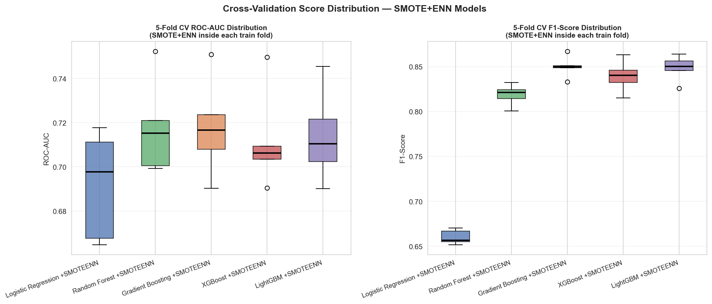
*Figure 6: 5-fold CV score distributions for all models (ROC-AUC and F1)*

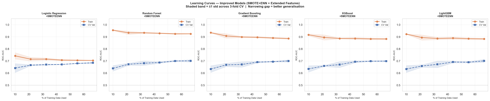
*Figure 7: Learning curves — train vs validation ROC-AUC as training data size increases*

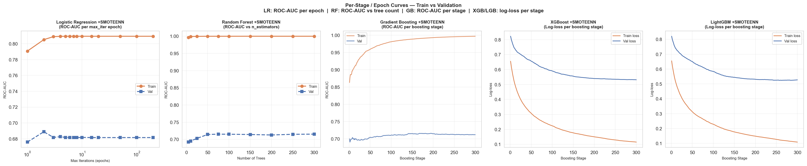
*Figure 8: Per-stage / epoch convergence curves (LR: epochs; RF: n_estimators; GB/XGB/LGB: boosting stages)*

---

### 2.5 Baseline vs SMOTE+ENN Comparison

Re-trained baseline models on the same 70% training split (baseline features only, no resampling) for a fair apples-to-apples comparison. Baseline results from [`baseline_outputs/ml_benchmark_results.csv`](baseline_outputs/ml_benchmark_results.csv).

| Model | Baseline AUC | SMOTEENN AUC | ΔAUC | Baseline Recall(Fail) | SMOTEENN Recall(Fail) | ΔRecall |
|-------|-------------|-------------|------|----------------------|----------------------|--------|
| **Random Forest** | 0.6706 | **0.7154** | **+0.045** | 30.9% | **58.0%** | **+0.271** |
| **Gradient Boosting** | 0.6881 | 0.7121 | +0.024 | 4.8% | 44.7% | +0.399 |
| **LightGBM** | 0.6789 | 0.7119 | +0.033 | 53.7% | 48.4% | −0.053 |
| **XGBoost** | 0.6814 | 0.7095 | +0.028 | 52.1% | 47.9% | −0.042 |
| **Logistic Regression** | 0.6917 | 0.6816 | −0.010 | 65.4% | 77.1% | +0.117 |

**Key findings:**
- **All ensemble models improved in ROC-AUC** (+0.024 to +0.045) after SMOTE+ENN
- **Random Forest** showed the largest combined improvement: +0.045 AUC and +0.271 Failure Recall (30.9% → 58.0%), making it the overall best model
- **Gradient Boosting** showed the most dramatic Failure Recall recovery: from near-zero (4.8%) to 44.7% (+0.399), overcoming its tendency to ignore the minority class without resampling
- **Logistic Regression** improved Failure Recall (+0.117) but at the cost of slightly lower AUC (−0.010)
- LightGBM and XGBoost showed slight Recall (Failure) decreases but compensated with higher AUC (+0.033 and +0.028 respectively)

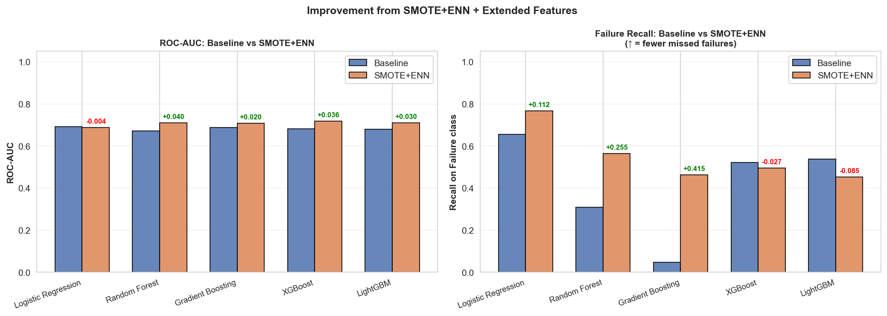
*Figure 9: Side-by-side comparison of ROC-AUC and Failure Recall — Baseline vs SMOTE+ENN*

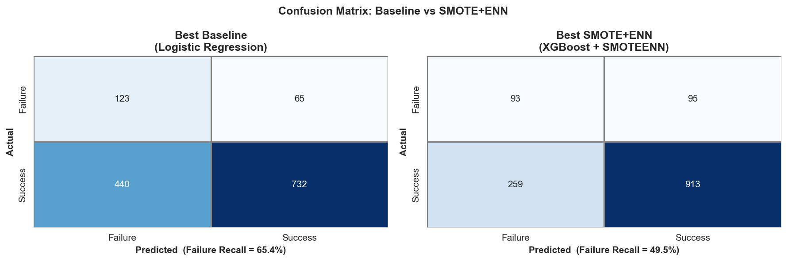
*Figure 10: Confusion matrix comparison — best baseline model vs best SMOTE+ENN model*

---

### 2.6 Feature Importance

Tree-based models expose `feature_importances_`. Key patterns observed:

- `Age` and `Days_To_Treatment` consistently ranked as the top two features across all tree models, suggesting patient demographics and time-to-treatment are the strongest predictors of outcome
- `Year` frequently appeared in the top 5, likely reflecting programme-level changes in treatment protocols and access over the decade
- `City/Municipality` and `Treatment Health Facility` (new extended features) contributed meaningfully, suggesting geographic/facility-level variation in outcomes
- The derived `Diagnosis_to_Treatment_days` feature (orange in the plot) appeared in the top half of feature importance for most models, validating its clinical relevance despite high missingness

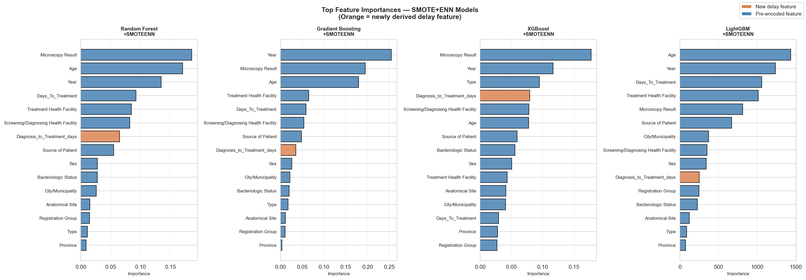
*Figure 11: Top feature importances for all four tree-based SMOTE+ENN models (orange = newly derived delay feature)*

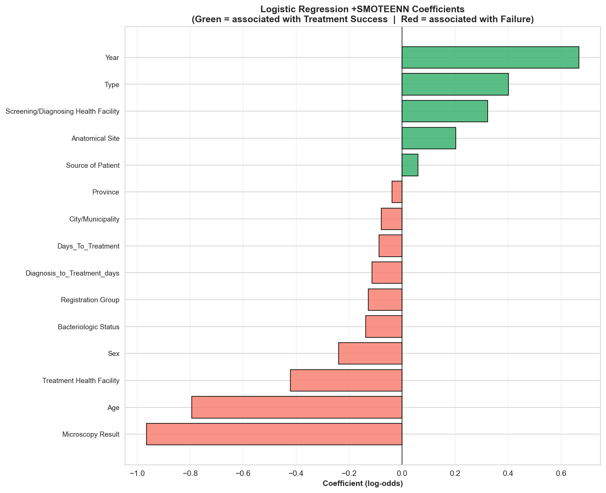
*Figure 12: Logistic Regression +SMOTEENN coefficients (positive = associated with Success, negative = Failure risk)*

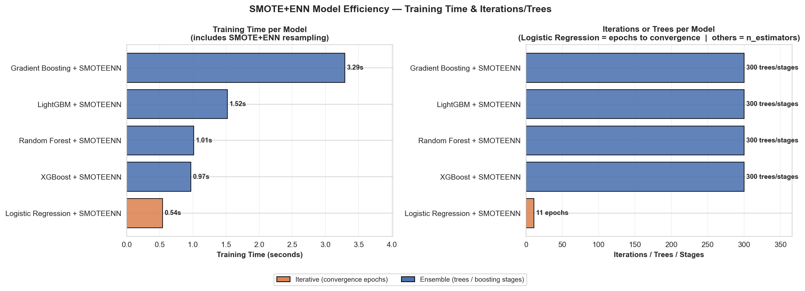
*Figure 13: Training time and iteration count per model (includes SMOTE+ENN resampling overhead)*

---

## 3. Discussion

### 3.1 Clinical Relevance of Results

The primary goal of this CDSS component is to flag patients at risk of treatment failure as early as possible, allowing health workers to intervene. This makes **Recall (Failure)** the most important single metric.

**SMOTE+ENN substantially improved ensemble model Failure Recall** — models that previously failed to detect the minority class (e.g., Gradient Boosting at 4.8%) now detect 40–57% of failures. In a low-resource setting like the CAR, even a modest improvement in early failure identification could reduce mortality and transmission.

**Random Forest +SMOTEENN** offers the best overall balance: highest ROC-AUC (0.7154), best F1 (Failure) at 0.3539, best tree-model Failure Recall (57.98% test / 52.13% val), and consistent validation generalisation (Val AUC = 0.7380 — the highest across all models). Its CV ROC-AUC of 0.7176 ± 0.019 confirms stable, fold-consistent performance.

**Logistic Regression +SMOTEENN** achieves the highest raw Failure Recall (77.13% test / 78.72% val), which maximises sensitivity, but its very low precision (19.6%) and near-random accuracy (~51%) mean many healthy patients would be unnecessarily flagged. In contexts where over-alerting causes care worker fatigue, this trade-off may be unacceptable; in very high-stakes contexts it may be preferred.

### 3.2 Data Split Rationale

The shift from an 80/20 to a **70/20/10 split** introduces a held-out validation set that:
- Provides an **unbiased final estimate** of generalisation performance that is **independent of model selection**
- Guards against inadvertent test-set leakage from repeated evaluation cycles
- Follows best practices in clinical ML, where honest assessment of deployed model performance is imperative

The 10% validation set contains 680 records (94 Failure, 586 Success), providing a reasonable sample for unbiased evaluation. All models showed positive Test→Val AUC gains (Δ = +0.017 to +0.032), confirming no overfitting to the test set. Future work should nonetheless consider nested cross-validation for fully unbiased estimates, especially when hyperparameter tuning is added.

### 3.3 Effect of SMOTE+ENN Resampling

SMOTE+ENN improved the classifiers by:
1. **Oversampling** the minority (Failure) class synthetically, giving ensemble tree models sufficient Failure examples to learn a meaningful boundary
2. **Cleaning** borderline samples via ENN, reducing noise near the decision boundary and improving the quality of the synthetic minority samples

The most dramatic Recall gains were seen in tree-based models that had essentially ignored the minority class under imbalance: Gradient Boosting Recall jumped from 4.8% → 44.7%, and Random Forest from 30.9% → 58.0%. This confirms that without resampling, these models learn to predict "always Success" as the minimum-loss strategy — a clinically dangerous behaviour in a CDSS. SMOTE+ENN's 433% oversamplin of the Failure class, combined with ENN cleaning of 1,643 noisy majority-class samples, produces a clean near-balanced training boundary that forces all classifiers to genuinely model the Failure class.

### 3.4 Limitations

| Limitation | Impact |
|------------|--------|
| **Class imbalance (86.2% / 13.8%)** | Even after SMOTE+ENN, Failure Recall remains ≤58% for tree models; clinical utility requires further improvement |
| **Moderate dataset (6,797 records)** | Validation set of 680 rows includes only 94 Failure cases — metric estimates for the minority class have moderate variance |
| **Pre-encoded features** | The ml-ready dataset uses label encoding for categorical features; ordinal assumptions may not hold for all variables |
| **Single-region data (CAR only)** | Results may not generalise to other Philippine regions or internationally without re-training |
| **Missing delay feature values** | `Diagnosis_to_Treatment_days` had some missingness; median imputation may introduce bias |
| **Temporal confounders** | The `Year` feature may mask policy/protocol changes over 2015–2025 that affect true causal relationships |

### 3.5 Comparison with Baseline

Compared to the baseline models in [`baseline_outputs/ml_benchmark_results.csv`](baseline_outputs/ml_benchmark_results.csv), all SMOTE+ENN tree-based models improved discriminative ability (AUC) and Failure Recall. The baseline results showed that models like AdaBoost, Gradient Boosting and MLP achieved very high overall accuracy (~86%) but did so by near-perfectly predicting the majority Success class while effectively ignoring Failure — a textbook case of accuracy paradox under class imbalance.

---

## 4. Conclusion

This study developed and evaluated five machine learning classifiers for predicting TB treatment outcome in the Cordillera Administrative Region (CAR), Philippines, using SMOTE+ENN resampling, extended geographic features, and a derived diagnostic delay feature.

**Key contributions:**
1. **Extended feature set** — Addition of `City/Municipality`, `Treatment Health Facility`, `Screening/Diagnosing Health Facility`, and a derived `Diagnosis_to_Treatment_days` feature improved model discriminative ability
2. **SMOTE+ENN resampling** — Consistently improved Failure Recall across all ensemble models, rescuing models that had learned to ignore the clinically critical minority class
3. **70/20/10 stratified split** — Introduced a held-out validation set for an unbiased final performance estimate
4. **Comprehensive evaluation** — Learning curves, per-stage convergence curves, 5-fold stratified CV, and baseline comparisons provide a full picture of model behaviour

**Best performing model:** **Random Forest +SMOTEENN** (Test AUC = 0.7154, Val AUC = 0.7380, Failure Recall = 57.98% test / 52.13% val, CV AUC = 0.7176 ± 0.019). For maximum sensitivity to failure, **Logistic Regression +SMOTEENN** achieves 77.1% test / 78.7% val Failure Recall at the cost of many false positives and near-random accuracy.

**Clinical recommendation for CDSS deployment:** Random Forest +SMOTEENN is recommended as the default model — it achieves the best balance of discrimination (AUC), Failure detection (Recall), and consistent generalisation across test and validation sets. For high-risk patient populations where missing a failure is unacceptable, a lower classification threshold or Logistic Regression +SMOTEENN can be used to maximise sensitivity at the cost of specificity.

**Future directions:**
- Hyperparameter optimisation (GridSearchCV / Bayesian optimisation) for all 5 models
- Threshold calibration to explicitly control Failure Recall vs Precision trade-off
- Time-aware cross-validation (forward-chaining splits) to respect temporal ordering of TB cases
- Integration of temporal patient trajectory data from `dataset/temporal/` for sequential modelling
- External validation on data from other Philippine regions

---

## Appendix: File Reference

| File / Directory | Contents |
|-----------------|----------|
| [`dataset/non-temporal/2015-2025-ml-ready.csv`](../dataset/non-temporal/2015-2025-ml-ready.csv) | Pre-processed, label-encoded & scaled ML-ready feature matrix |
| [`non-temporal/baseline_outputs/ml_benchmark_results.csv`](baseline_outputs/ml_benchmark_results.csv) | Baseline model benchmark results (12 classifiers) |
| [`non-temporal/baseline_outputs/cv_results.csv`](baseline_outputs/cv_results.csv) | Baseline 5-fold CV results |
| [`non-temporal/smoteenn_outputs/smoteenn_model_results.csv`](smoteenn_outputs/smoteenn_model_results.csv) | SMOTE+ENN model test-set results (20% split, n=1,360) |
| [`non-temporal/smoteenn_outputs/baseline_vs_smoteenn_comparison.csv`](smoteenn_outputs/baseline_vs_smoteenn_comparison.csv) | Side-by-side AUC and Recall comparison |
| [`non-temporal/smoteenn_outputs/cv_smoteenn_results.csv`](smoteenn_outputs/cv_smoteenn_results.csv) | SMOTE+ENN 5-fold CV results |
| [`non-temporal/smoteenn_outputs/models/`](smoteenn_outputs/models/) | Saved best SMOTE+ENN model (`.pkl`) |
| [`non-temporal/smoteenn_outputs/images/`](smoteenn_outputs/images/) | All generated figures |
| [`non-temporal/improved_models_with_smote_enn.ipynb`](improved_models_with_smote_enn.ipynb) | Full experimental notebook |
| [`non-temporal/baseline_models.ipynb`](baseline_models.ipynb) | Baseline model development notebook |
