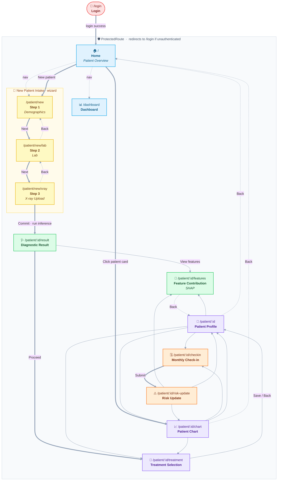

# UI Flowchart — TB-DOTS CAR CDSS Web App

Generated from `web-app/src/App.tsx` (routes) and per-page `navigate(...)` calls.

## Screen flow

**Legend** — 🔵 persistent nav · 🟡 intake wizard · 🟢 diagnostic · 🟣 patient hub · 🟠 follow-up loop.
Thick arrows (**⟹**) = primary path · thin = secondary action · dotted = back/nav.

## Persistent navigation

Available on every protected screen via the desktop sidebar (`DesktopLayout`) and the
mobile bottom bar (`BottomNav`):

| Label | Route |
|-------|-------|
| Patients / Patient Overview | `/` |
| Dashboard | `/dashboard` |
| New Patient | `/patient/new` |
| Logout | → `/login` |

## Two entry paths into a patient

1. **New patient (wizard):** Home → Intake Step 1 → Step 2 (Lab) → X-ray → **Diagnostic Result** → Treatment.
2. **Existing patient:** Home (patient card) → **Patient Chart** → Profile / Check-in / Treatment.

The **Patient Profile** acts as the central hub for an existing patient, linking out to
Features (SHAP), Monthly Check-in, Treatment, and Chart.
